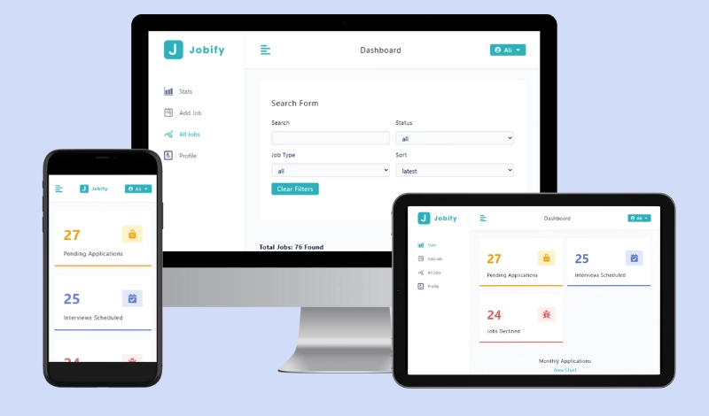

## 🚀 Live Demo

Check out the live demo of the Jobify app: [Live Demo](https://jobify-liwk.onrender.com/)

# 💼 Jobify – Job Tracking App

The **Jobify App** is a complete **MERN stack application** designed to help users track their job search efficiently.  
Unlike simple demos, this project includes **everything a professional MERN developer should implement** — authentication, CRUD operations, search, filtering, pagination, and security best practices.

This project demonstrates my ability to build **production-ready full-stack applications** with a clean UI, secure backend, and scalable architecture.

---

## ✨ Features

- **User Authentication & Authorization**: Secure login and signup using JWT & cookies.  
- **Job Management (CRUD)**: Create, read, update, and delete job applications.  
- **Search & Filtering**: Find jobs by status, type, and keywords.  
- **Pagination**: Browse large job listings efficiently.  
- **Statistics & Charts**: Visualize job data and trends with Recharts.  
- **Security Middleware**: Helmet, XSS-Clean, Mongo Sanitize, and Rate Limiting for secure APIs.  
- **Responsive Design**: Optimized for all screen sizes with a modern UI.  

---

## 🛠 Technologies Used

### Frontend
- **React 19** with **Vite** for fast builds  
- **React Router v7** for navigation  
- **Styled Components** for modern styling  
- **Axios** for API communication  
- **Recharts** for data visualization  
- **Normalize.css** for consistent styles  

### Backend
- **Node.js** & **Express.js** for server and REST APIs  
- **MongoDB + Mongoose** for database  
- **JWT Authentication** with cookies  
- **Bcrypt.js** for password hashing  
- **Express Async Errors** for clean error handling  
- **Helmet, XSS-Clean, Express-Rate-Limit, Mongo Sanitize** for security  
- **Moment.js** for date/time formatting  

---

## 👨‍💻 Author

**Ali Fadel**  
- Portfolio: [ali-fadel-vercel.app](https://ali-fadel-vercel.app)  
- GitHub: [Ali-Fadel-profile](https://github.com/Ali-Fadel-profile)  
